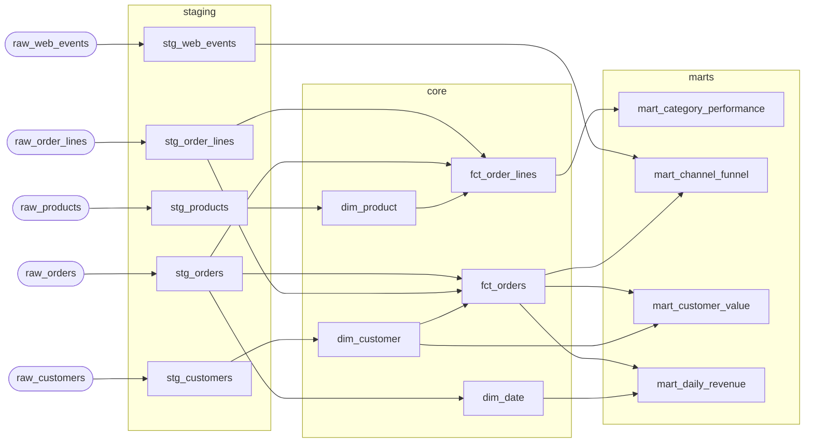

# Retail ELT Pipeline

Messy data goes in. A clean, tested warehouse comes out.

Five source systems send data that looks the way real source data always looks: the same order arrives twice, a currency is spelled EUR in one row and eur in the next, a customer ID points at somebody who doesn't exist yet. This pipeline takes all of it, cleans it, reshapes it into tables an analyst can actually query and then checks its own work 58 different ways before letting anyone see the result.

If something is badly wrong, the run stops. If something is only slightly odd, it gets logged and the run finishes. Nobody gets woken at 3am for a rounding difference.

The SQL is dialect-neutral and CI proves it: every model runs unchanged on both
**DuckDB** and **SQLite**, producing identical results.

```
Python 3.10+  ·  14 models  ·  58 data quality checks  ·  43 tests  ·  MIT
```

---

## Contents

- [Quickstart](#quickstart)
- [Architecture](#architecture)
- [The data quality framework](#the-data-quality-framework)
- [Usage](#usage)
- [Orchestration](#orchestration)
- [Design notes](#design-notes)
- [Limitations](#limitations)

---

## Quickstart

```bash
git clone https://github.com/<you>/retail-elt-pipeline.git
cd retail-elt-pipeline

python -m venv .venv
source .venv/bin/activate          # Windows: .venv\Scripts\activate
pip install -r requirements.txt

make seed     # generate ~20k orders of synthetic source data
make run      # extract → transform → test → export
make test     # 43 unit and integration tests
```

`make run` prints a run report and writes it to `artifacts/run_report.json`:

```json
{
  "engine": "duckdb",
  "status": "success",
  "extracted": { "raw_orders": 4032, "raw_order_lines": 11945, "...": "..." },
  "quality":   { "total": 58, "passed": 57, "errors": 0, "warnings": 1 },
  "exports":   { "mart_daily_revenue": 1582, "mart_customer_value": 800 }
}
```

The one warning is intentional — see [orphan foreign keys](#orphan-foreign-keys-are-conformed-not-dropped).

---

## Architecture

```
  SFTP / Kafka / CRM exports
            │
            ▼
     ┌─────────────┐
     │   extract   │   land everything as TEXT, no cleaning, no loss
     └─────────────┘
            │
            ▼
     ┌─────────────┐
     │   staging   │   type, trim, deduplicate, normalise  ── quality gate ──┐
     └─────────────┘                                                          │
            │                                                                 │
            ▼                                                            fail here,
     ┌─────────────┐                                                     not later
     │    core     │   dim_* / fct_*  ·  star schema                          │
     └─────────────┘                                                          │
            │                                                                 │
            ▼                                                                 │
     ┌─────────────┐                                                          │
     │    marts    │   business-facing aggregates  ──── quality gate ─────────┘
     └─────────────┘
            │
            ▼
       CSV exports
```

### Model lineage



Regenerate with `make graph`. The graph is derived from the SQL, not maintained
by hand — each model declares its parents in a header comment, and execution
order comes from a topological sort (Kahn's algorithm) with deterministic tie
breaking.

### Modules

| Module | Responsibility |
| :--- | :--- |
| `generate_source_data.py` | Synthetic sources with reproducible, realistic defects |
| `extract.py` | Land raw files as untyped tables — no cleaning at this stage |
| `warehouse.py` | Thin DuckDB wrapper with a SQLite fallback and a quote-aware SQL splitter |
| `transform.py` | Parse model headers, resolve the DAG, materialise as table or view |
| `quality.py` | Compile declarative tests into SQL, run them, report by severity |
| `run.py` | Orchestrator and CLI |

### The model format

Each `.sql` file is a single `SELECT` plus a short header:

```sql
-- materialized: table
-- description: One row per order, with line totals rolled up and FKs resolved.
-- depends_on: stg_orders, stg_order_lines, dim_customer

SELECT ...
```

Materialisation is applied by the runner rather than written into the file. That
keeps the SQL portable, and switching a model between `view` and `table` is a
one-word change.

---

## The data quality framework

Tests are declared per model in `models/schema.yml` and compiled into SQL that
returns violating rows. **Zero rows is a pass.** Every failure therefore comes
with a query you can paste straight into a console to see the offending records.

```yaml
- name: fct_orders
  tests:
    - expression:
        condition: ABS(gross_amount - discount_amount - net_amount) < 0.05
  columns:
    - name: order_id
      tests: [not_null, unique]
    - name: customer_key
      tests:
        - relationships: {to: dim_customer, field: customer_id}
    - name: is_orphan_customer
      tests:
        - accepted_values: {values: [0], severity: warn}
```

| Test | Checks |
| :--- | :--- |
| `not_null` | No nulls in the column |
| `unique` | No duplicate values |
| `accepted_values` | Every value is in an allowed set |
| `relationships` | Foreign key resolves in the parent model |
| `non_negative` | No values below zero |
| `between` | Values within a numeric range |
| `row_count_between` | Model size within expected bounds |
| `expression` | An arbitrary condition holds for every row |
| `freshness` | Model is not lagging a reference model |

**Severity is the important part.** `error` fails the run; `warn` is recorded
and reported but lets the pipeline finish. Not every anomaly should stop a
pipeline at 03:00 — but every anomaly should be visible in the morning.

---

## Usage

```bash
make seed                    # regenerate source data
make run                     # full pipeline
make quality                 # re-run just the quality suite
make lineage                 # print the DAG in execution order
make graph                   # print the DAG as Mermaid
make sqlite                  # run the same models on SQLite
make clean                   # remove data/, artifacts/, warehouse
```

Ad hoc SQL against the warehouse:

```bash
make query SQL="SELECT order_month, SUM(net_revenue) FROM mart_daily_revenue GROUP BY 1 ORDER BY 1"
```

Or via the CLI directly:

```bash
python -m pipeline.run run --skip-tests    # transform only
python -m pipeline.run test                # quality suite, exits non-zero on error
python -m pipeline.run lineage --mermaid
```

### The marts

| Mart | Grain | Contents |
| :--- | :--- | :--- |
| `mart_daily_revenue` | date × channel | Orders, customers, gross/net revenue, AOV, weekday context |
| `mart_customer_value` | customer | Lifetime revenue, order count, recency bucket, value tier |
| `mart_category_performance` | month × category | Units, revenue, COGS, gross margin %, return rate |
| `mart_channel_funnel` | month | Session funnel from page view to checkout, joined to realised revenue |

All four are exported to `artifacts/marts/*.csv` on every run.

---

## Orchestration

`airflow/dags/retail_elt_dag.py` splits the run into one task per layer rather
than wrapping everything in a single operator:

```
start → extract → build_staging → test_staging → build_core
                                                      ↓
        end ← export_marts ← test_final ← build_marts
```

Two reasons this shape matters:

1. **A failure tells you where it broke** from the Airflow UI alone, and a retry
   re-runs only the failed layer instead of reloading every source file.
2. **The quality suite runs twice** — once after staging, so a bad source file
   fails before it propagates into the dimensional model, and once at the end.
   Catching it early is the difference between a five-minute rerun and a full
   rebuild.

Retries use exponential backoff, because the usual transient failure here is
object storage throttling, and it clears in seconds.

The pipeline runs standalone without Airflow; the DAG is a thin wrapper over the
same functions the CLI calls.

---

## Design notes

### ELT, not ETL

Extract does no cleaning at all. Every column lands as text and every row that
was in the file is in the table. Casting, deduplication and normalisation happen
in staging, where the logic is version controlled, testable, and re-runnable
against data you have already paid to move. When a cast is wrong, you fix the
model and rebuild — you do not re-extract.

### The source data is dirty on purpose

`generate_source_data.py` reproduces defects that real feeds actually have:

- **Duplicate rows** — the order bus is at-least-once, so ~0.8% of orders arrive
  twice, byte-identical. Deduplicated with `ROW_NUMBER()` in staging.
- **Orphan foreign keys** — the CRM extract runs an hour before the order
  extract, so ~1.5% of orders reference customers that do not exist yet.
- **Mixed casing** — `EUR`, `eur`, `USD`, `usd` straight from the payment provider.
- **Blank mandatory fields** — the CRM permits an empty `segment`.
- **Negative quantities** — returns booked against the original order rather than
  as separate credit notes.

The seed is fixed, so the quality suite fails the same way on every machine.

### Orphan foreign keys are conformed, not dropped

An inner join from `fct_orders` to `dim_customer` would silently delete ~1.5% of
revenue. Instead the dimension carries an `UNKNOWN` member and orphans are routed
to it, with `is_orphan_customer` flagged on the fact row. The quality suite
tracks the rate at `severity: warn` — visible every morning, never silently lost,
and never a 3am page.

An integration test asserts `count(stg_orders) == count(fct_orders)`: no order may
be lost to a failed dimension join.

### Portability is enforced, not aspirational

The models avoid vendor date functions entirely — date parts are derived with
`SUBSTR` over ISO-8601 strings. `dim_date` computes weekday via **Zeller's
congruence** in pure SQL rather than calling a date function, and a test verifies
all 560 generated dates against Python's `datetime`.

This caught a real bug: **DuckDB's `/` returns a double and `CAST` rounds, while
SQLite's `/` floors integer division.** `CAST((month + 2) / 3 AS INTEGER)` gave
December a `quarter_number` of 5 on DuckDB, and the same rounding silently
corrupted every weekday. The fix is explicit `FLOOR()`, and the SQLite CI job is
what stops it recurring.

### Reconciliation is the test that matters

Uniqueness and not-null tests catch schema problems. The test that catches a
broken *join* is arithmetic reconciliation:

```sql
ABS(gross_amount - discount_amount - net_amount) < 0.05
```

Integration tests extend this across grains — line totals must roll up to the
order grain, and the order grain must roll up to the mart. A fan-out from a
duplicated dimension row shows up here immediately and nowhere else.

---

## Limitations

- **Full refresh only.** Every model rebuilds from scratch. Incremental
  materialisation with a late-arrival lookback window is the obvious next step,
  and the model header format already has room for it.
- **No slowly changing dimensions.** `dim_customer` is Type 1 — history is
  overwritten. Type 2 would need effective-dated rows and a surrogate key.
- **Single-node.** DuckDB is excellent up to a few hundred GB. Beyond that this
  becomes a Spark or warehouse-native job, though the model format and quality
  framework would carry over.
- **The YAML parser is a subset.** PyYAML is used when installed; the built-in
  fallback covers only the shapes `models/schema.yml` actually uses.
- **Synthetic data.** Volumes and distributions are plausible but invented.

---

## Project layout

```
src/pipeline/       library code (6 modules)
sql/staging/        5 models — typing, cleaning, deduplication
sql/core/           5 models — star schema (dim_* / fct_*)
sql/marts/          4 models — business-facing aggregates
models/schema.yml   58 declarative data quality tests
tests/              43 unit and integration tests
airflow/dags/       DAG with per-layer tasks and two quality gates
.github/workflows/  CI on Python 3.10 / 3.12, plus DuckDB and SQLite runs
```

## License

MIT — see [LICENSE](LICENSE).
